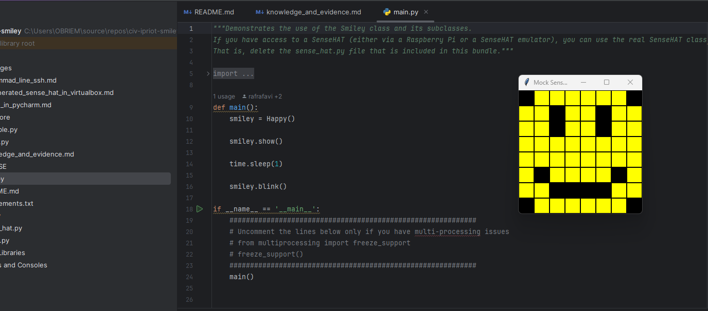
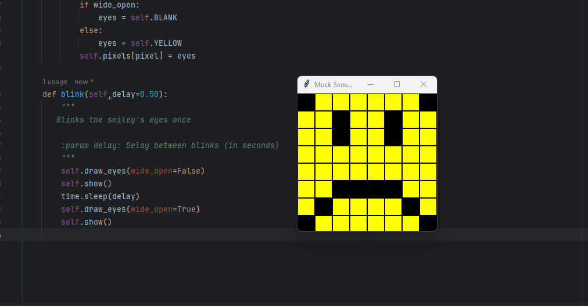
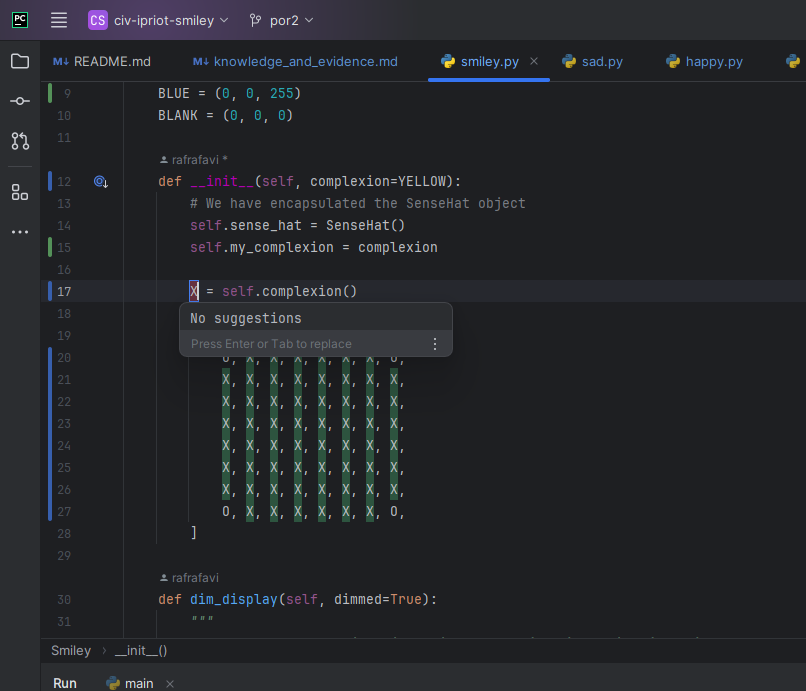

<style>

body {
    counter-reset: h2counter;
}

/* H1 - No numbering */
h1 {
    /* No counter reset or increment */
}

/* H2 - Level 1 numbering */
h2 {
    counter-reset: h3counter;
}

h2::before {
    counter-increment: h2counter;
    content: counter(h2counter) ". ";
}

/* H3 - Level 2 numbering */
h3 {
    counter-reset: h4counter;
}

h3::before {
    counter-increment: h3counter;
    content: counter(h2counter) "." counter(h3counter) " ";
}

/* H4 - Level 3 numbering (optional) */
h4 {
    counter-reset: h5counter;
}

h4::before {
    counter-increment: h4counter;
    content: counter(h2counter) "." counter(h3counter) "." counter(h4counter) " ";
}

</style>

# Evidence and Knowledge

This document includes instructions and knowledge questions that must be completed to receive a *Competent* grade on this portfolio task.

## Required evidence

### Answer all questions in this document

- Each answer should be complete, well-articulated, and within the specified word count limits (if added) for each question.
- Please make sure **all** external sources are properly cited.
- You must **use your own words**. Please include your full chat transcripts if you use generative AI in any way.
- Generative AI hallucinates, is not an authoritative source

### Make all the required modifications to the code

- Please follow the instructions in this document to make the changes needed to the code.

- When requested to upload evidence, upload all screenshots to `screenshots/` and embed them in this document. For example:

```markdown

```

- You must upload the code into your GitHub repository.
- While you can use a branch, your code should be in main when you submit.
- Upload a zip of this repository to Blackboard when you are ready to submit.
- You will be notified of your result via Blackboard
- However, if using GitHub classrooms, you may also receive additional feedback on GitHub directly

### Optional: Use of Raspberry Pi and SenseHat

Raspberry Pi or SenseHat is **optional** for this activity. You can use the included `sense_hat.py` file to simulate the SenseHat on your computer.

If you use a Pi, please **delete** the `sense_hat.py` file.

### Accessible version of the code

This project relies on visual patterns that appear on an LED matrix. If you have any accessibility requirements, you can use the `udl/accessible` branch to complete the project. This branch provides an accessible code version that uses text-based patterns instead of visual ones.

Please discuss this with your lecturer before using that branch.

## Specific Tasks & Questions

Address the following tasks and questions based on the code provided in this repository.

### Set up the project locally

1. Fork this repository (if not using GitHub Classrooms)
2. Clone your repository locally
3. Run the project locally by executing the `main.py` file
4. Evidence this by providing screenshots of the project directory structure and the output of the `main.py` file



If you are running on a Raspberry Pi, you can use the following command to run the project and then screenshot the result:

```bash
ls
python3 main.py
```

### Fundamental code comprehension

 Answer each of the following questions **as they relate to that code** supplied by in this repository (ignore `sense_hat.py`):

1. Examine the code for the `smiley.py` file and provide  an example of a variable of each of the following types and their corresponding values (`_` should be replaced with the appropriate values):

   | Type                    | name   | value |
   | ----------              |--------|-------|
   | built-in primitive type | dimmed | Bool  |
   | built-in composite type | red    | Tuple |
   | user-defined type       | Smiley | Class |

2. Fill in (`_`) the following table based on the code in `smiley.py`:

   | Object                   | Type                         |
   | ------------             |------------------------------|
   | self.pixels              | List                         |
   | A member of self.pixels  | Tuple                        |
   | self                     | Smiley/of instantiated class |

3. Examine the code for `smiley.py`, `sad.py`, and `happy.py`. Give an example of each of the following control structures using an example from **each** of these files. Include the first line and the line range:

   | Control Flow | File      | First line           | Line range |
   | ------------ |-----------|----------------------|------------|
   |  sequence    | smiley.py | Y = self.YELLOW      | 15-26      |
   |  selection   | sad.py    | if wide_open:        | 26-30      |
   |  iteration   | happy.py  | for pixel in mouth:  | 21-22      |

4. Though everything in Python is an object, it is sometimes said to have four "primitive" types. Examining the three files `smiley.py`, `sad.py`, and `happy.py`, identify which of the following types are used in any of these files, and give an example of each (use an example from the code, if applicable, otherwise provide an example of your own):

   | Type                    | Used?                | Example               |
   | ----------------------- |----------------------|-----------------------|
   | int                     | smiley.py (in tuple) | WHITE = (255,255,255) |
   | float                   | happy.py             | delay=0.25            |
   | str                     | Not used             | string = 'a string'   |
   | bool                    | sad.py               | wide_open=True        |

5. Examining `smiley.py`, provide an example of a class variable and an instance variable (attribute). Explain **why** one is defined as a class variable and the other as an instance variable.

> class variable: WHITE, RED, etc. Instance variable: Dimmed.
> WHITE is a class variable so that the value of white is always the same value, regardless of instance. <br>
> Dimmed is an instance variable meaning that the value of dimmed may be different between instances of smiley. 

6. Examine `happy.py`, and identify the constructor (initializer) for the `Happy` class:
   1. What is the purpose of a constructor (in general) and this one (in particular)?

   > __init__(self) <br>
   > the purpose of a constructor is to instantiate objects (instances of classes) which may include assigning values to variables. In this case it calls methods to draw a face

   2. What statement(s) does it execute (consider the `super` call), and what is the result?

   > it executes the __init__ from smiley which sets up the pixel array, it then calls to of its methods `draw_mouth` and `draw_eyes`.
   >

### Code style

1. What code style is used in the code? Is it likely to be the same as the code style used in the SenseHat? Give to reasons as to why/why not:
   
> PEP8
> SenseHat is likely PEP8 as well, evidenced by the pascalcase class name, snake_case method names and verbs in method names

2. List three aspects of this convention you see applied in the code.

> lowercase names for most things apart from classes and constants and underscores in place of spaces (snakecase) <br>
> four spaces for indentation <br>
> whitespace (for example: parameter default assignments like delay=0.25, dimmed=True) 

3. Give two examples of organizational documentation in the code.

> Docstrings (""" "").
> comments (#).

### Identifying and understanding classes

> Note: Ignore the `sense_hat.py` file when answering the questions below

1. List all the classes you identified in the project. Indicate which classes are base classes and which are subclasses. For subclasses, identify all direct base classes.
  
  Use the following table for your answers:

| Class Name | Super or Sub? | Direct parent(s)  |
|------------|---------------|-------------------|
| NotReal    | Sub           | NotRealParent     |
| Main       | super         |                   |
| Smiley     | super         |                   |
| Blinkable  | sub           | ABC               |
| Happy      | sub           | Smiley, Blinkable |
| Sad        | sub           | Smiley            |

2. Explain the concept of abstraction, giving an example from the project (note "implementing an ABC" is **not** in itself an example of abstraction). (Max 150 words)

> abstraction is the process of hiding the internal workings or implementation of something (class or data) and thus simplifying its use.  
> An example of abstraction within the project is the main function found in main.py. <br> From the perspective of that file it only looks like four statements but in reality those four statements are comprised of more methods and variables (for example smiley.blink which itself call self.draw_eyes and self.show and so on.)

3. What is the name of the process of deriving from base classes? What is its purpose in this project? (Max 150 words)

> Inheritance <br>
> The purpose of inheriting in this project is to have happy and sad inherit the colours (WHITE, RED, ETC.) and `pixels.self` (through the use of `super.__init__`) from smiley, and for happy to inherit the blink method from blinkable. 

### Compare and contrast classes

Compare and contrast the classes Happy and Sad.

1. What is the key difference between the two classes?
   > happy inherits from blinkable(meaning it has a blink method) while sad does not. <br>
   > values for mouth are different. <br>
   > `draw_eyes` is written differently between sad and happy (the logic is the same though)
2. What are the key similarities?
   > they both have the `draw_mouth` and `draw_eyes` methods <br>
   > both inherit from smiley
3. What difference stands out the most to you and why?
   > the fact happy inherits from blinkable while sad does not. <br>
   > it stands out because it means that happy has extra functionality that sad does not
4. How does this difference affect the functionality of these classes
   > it affects the functionality of the classes because it means that happy can blink while sad can not.
   >

### Where is the Sense(Hat) in the code?

1. Which class(es) utilize the functionality of the SenseHat?
   > Smiley and classes that inherit from Smiley (Sad and Happy).
   >
2. Which of these classes directly interact with the SenseHat functionalities?
   > Smiley
   >
3. Discuss the hiding of the SenseHAT in terms of encapsulation (100-200 Words)
   > By encapsulating The sensehat class it limits what can be done with it preventing methods within the sensehat class being used.
   >

### Sad Smileys Can’t Blink (Or Can They?)

Unlike the `Happy` smiley, the current implementation of the `Sad` smiley does not possess the ability to blink. Let's first explore how blinking has been implemented in the Happy Smiley by examining the blink() method, which takes one argument that determines the duration of the blink.

**Understanding Blink Mechanism:**

1. Does the code's author believe that every `Smiley` should be able to blink? Explain.

> No. <br>
> If the author believed that every smiley should be able to blink then the blink method would have been included in the Smiley in some way (meaning classes that inherit from smiley (happy and sad) would also be able to blink)

2. For those smileys that blink, does the author expect them to blink in the same way? Explain.

> No. <br>
> if the author expected smileys to blink the same the blinkable class that they inherit from would have defined the way they *should* blink. (basically saying *"if you can blink then you must blink like this"*)

3. Referring to the implementation of blink in the Happy and Sad Smiley classes, give a brief explanation of what polymorphism is.

> Polymorphism is the ability to perform the same action with different input, for example, with the happy and sad smiley, it's possible for both smileys to inherit the blink method but blink differently.

4. How is inheritance used in the blink method, and why is it important for polymorphism?
>  While in dynamically typed languages inheritance in relation to polymorphism is mostly for semantic reasons, in statically typed languages inheritance is a requirement for polymorphism, 
>
1. **Implement Blink in Sad Class:**

   - Create a new method called `blink` within the Sad class. Ensure you use the same method signature as in the Happy class:

   ```python
   def blink(self, delay=0.25):
       pass  # Replace 'pass' with your implementation
   ```

2. **Code Implementation:** Implement the code that allows the Sad smiley to blink. Use the implementation from the Happy Smiley as a reference. Ensure your new method functions similarly by controlling the blink duration through the `delay` argument.

3. **Testing the Implementation:**

- Test the new blink functionality on your Raspberry Pi or within the Python classes provided. You might need to adjust the `main.py` script to incorporate Sad Smiley's new blinking capability.

Include a screenshot of the sad smiley or the modified `main.py`:



- Observe and document the Sad smiley as it blinks its eyes. Describe any adjustments or issues encountered during implementation.

  > no issues.

  ### If It Walks Like a Duck…

  Previously, you implemented the blink functionality for the Sad smiley without utilizing the class `Blinkable`. Assuming you did not use `Blinkable` (even if you actually did), consider how the Sad smiley could blink similarly to the Happy smiley without this specific class.

  1. **Class Type Analysis:** What kind of class is `Blinkable`? Inspect its superclass for clues about its classification.

     > Blinkable is an Abstract class

  2. **Class Implementation:** `Blinkable` is a class intended to be implemented by other classes. What generic term describes this kind of class, which is designed for implementation by others? **Clue**: Notice the lack of any concrete implementation and the naming convention.

  > Interface

  3. **OO Principle Identification:** Regarding your answer to question (2), which Object-Oriented (OO) principle does this represent? Choose from the following and justify your answer in 1-2 sentences: Abstraction, Polymorphism, Inheritance, Encapsulation.

  > Abstraction

  4. **Implementation Flexibility:** Explain why you could grant the Sad Smiley a blinking feature similar to the Happy Smiley's implementation, even without directly using `Blinkable`.

  > The reason Sad could have a blink method without inheriting from blinkable is because blinkable only provides the enforcement that anything that inherits from it must have a blink method.

  5. **Concept and Language Specificity:** In relation to your response to question (4), what is this capability known as, and why is it feasible in Python and many other dynamically typed languages but not in most statically typed programming languages like C#? **Clue** This concept is hinted at in the title of this section.

  > ducktyping, which is not possible in statically type languages because it is a requirement to declare the type of a variable in these languages.
  ***

  ## Refactoring

  ### Does a Smiley Have to Be Yellow?

  While our current implementation predominantly features yellow smileys, emotional expressions like sickness or anger typically utilize colors like green, red, or orange. We'll explore the feasibility of integrating these colors into our smileys.

  1. **Defined Colors and Their Location:**

     1. Which colors are defined and in which class(s)?
        > The colours WHITE, GREEN, RED and YELLOW. Defined in the Smiley class
     2. What type of variables hold these colors? Are the values expected to change during the program's execution? Explain your answer.
        > The colours are held in Constant variables (indicated by the all uppercase names), because these variables are constants it indicates that these variables are not intended to change during the program's execution.
     3. Add the color blue to the appropriate class using the appropriate format and values.

  2. **Usage of Color Variables:**

     1. In which classes are the color variables used?
        > Smiley, sad and happy (or anything that inherits from smiley, where the variables originate)

  3. **Simple Method to Change Colors:**
  4. What is the easiest way you can think to change the smileys to green? Easiest, not necessarily the best!
     > Change the values of the YELLOW constant. (change directly, not through the program)

  Here's a revised version of the "Flexible Colors – Step 1" section for the smiley project, incorporating your specifications for formatting and content updates:

  ### Flexible Colors – Step 1

  Changing the color of the smileys once is straightforward, but it isn't very flexible. To facilitate various colors for smileys, it is advisable not to hardcode values in any class. This approach was identified earlier as a necessary change. Let's start by removing the built-in assumptions about color in our classes.

  1. **Add a method called `complexion` to the `Smiley` class:** Implement this instance method to return `self.YELLOW`. Using the term "complexion" instead of "color" provides a more abstract terminology that focuses on the meaning rather than implementation.

  2. **Refactor subclasses to use the `complexion` method:** Modify any subclass that directly accesses the color variable to instead utilize the new `complexion` method. This ensures that color handling is centralized and can be easily modified in the future.

  3. **Determine the applicable Object-Oriented principle:** Consider whether Abstraction, Polymorphism, Inheritance, or Encapsulation best applies to the modifications made in this step.

  4. **Verify the implementation:** Ensure that the modifications function as expected. The smileys should still display in yellow, confirming that the new method correctly replaces the direct color references.

  This step is crucial for setting up a more flexible system for color management in the smiley display logic, allowing for easy adjustments and extensions in the future.

  ### Flexible Colors – Step 2

  Having removed the hardcoded color values, we now enhance the base class to support dynamic color assignments more effectively.

  1. **Modify the `__init__()` method in the `Smiley` class:** Introduce a default argument named `complexion` and assign `YELLOW` as its default value. This allows the instantiation of smileys with customizable colors.

  2. **Introduce a new instance variable:** Create a variable called `my_complexion` and assign the `complexion` parameter to it. This step ensures that each smiley instance can maintain its own color state.

  3. **Rationale for `my_complexion`:** Using a distinct instance variable like `my_complexion` avoids potential conflicts with the method parameter names and clarifies that it is an attribute specific to the object.

  4. **Bulk rename:** We want to update our grid to use the value of complexion, but we have so many `Y`'s in the grid. Use your IDE's refactoring tool to rename all instances of the **symbol** `Y` to `X`. Where `X` is the value of the `complexion` variable. Include a screenshot evidencing you have found the correct refactor tool and the changes made.

  

  5. **Update the `complexion` method:** Adjust this method to return `self.my_complexion`, ensuring that whatever color is assigned during instantiation is what the smiley displays.

  6. **Verification:** Run the updated code to confirm that Smileys still defaults to yellow unless specified otherwise.

  ### Flexible Colors – Step 3

  With the foundational changes in place, it's now possible to implement varied smiley colors for different emotional expressions.

  1. **Adjust the `Sad` class initialization:** In the `Sad` class's initializer method, change the superclass call to include the `complexion` argument with the value `self.BLUE`, as shown:

     ```python
     super().__init__(complexion=self.BLUE)
     ```

  2. **Test color functionality for the Sad smiley:** Execute the program to verify that the Sad smiley now appears blue.

  3. **Ensure the Happy smiley remains yellow:** Confirm that changes to the Sad smiley do not affect the default color of the Happy smiley, which should still display in yellow.

  4. **Design and Implement An Angry Smiley:** Create an Angry smiley class that inherits from the `Smiley` class. Set the color of the Angry smiley to red by passing `self.RED` as the `complexion` argument in the superclass call.

  ***
